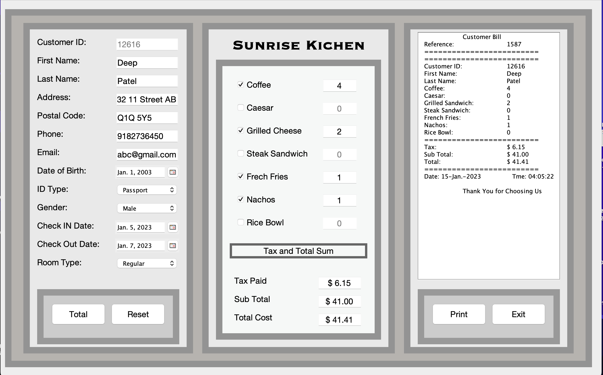

# Billing-System

Programming Language: Java

Software used: Apache NetBeans 16

A hotel's resturant billing system program that takes the customer's information and their order detail as a input and automatically calculate the total order price, tax and total price and prints the bill as output with unique bill reference number and unique customer ID which you can even print as a pdf.

